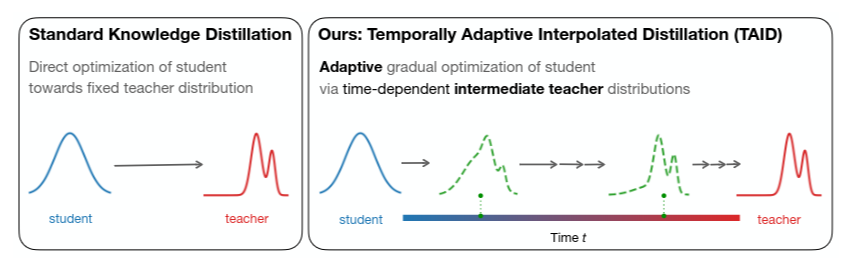

# TAID

[TAID](https://arxiv.org/pdf/2501.16937) (Temporally Adaptive Interpolated
Distillation) is knowledge distillation method for transferring
capabilities from a large teacher language model into a much smaller student model.

 A key challenge in knowledge distillation is the **capacity gap** between teacher and student. When the teacher is substantially more capable, the student may struggle to faithfully reproduce the teacher’s output distribution. Standard distillation can lead to **mode averaging**, where distinct behaviors are blended together, or **mode collapse**, where the student learns only a limited subset of the teacher’s behaviors. In either case, the student may fail to effectively follow the teacher.

 > “As state-of-the-art language models continue to grow in size and complexity, the capacity gap becomes increasingly critical in developing high-performing and compact student models. Addressing the capacity gap is crucial for effectively transferring knowledge from large-scale language models to more portable ones without sacrificing performance. Our experiments provide empirical evidence of the capacity gap and demonstrate how our proposed method addresses this challenge.”

 ### How TAID works

 TAID addresses the capacity gap by **interpolating between the student and teacher distributions over the course of training**.

 Rather than forcing the student to match the teacher from the beginning, TAID constructs an **adaptive intermediate target**. Early in training, this target is close to the student’s own distribution. As training progresses, it gradually moves toward the teacher’s distribution.

 This gives the student a moving target that evolves with its capabilities: the student first learns from a distribution it can represent, then progressively takes on more of the teacher’s behavior. The result is a smoother knowledge-transfer process that helps balance the competing risks of **mode averaging and mode collapse**.

 ### Standard distillation vs. TAID

*The target distribution gradually shifts from the student’s distribution toward the teacher’s distribution, adapting the difficulty of knowledge transfer over time.*

[TinySwallow-1.5B](./tinyswallow.md) is the instruction model
distilled using TAID from
[Qwen2.5-32B-Instruct](https://huggingface.co/Qwen/Qwen2.5-32B-Instruct).

## Reference

- [arXiv:2501.16937](https://arxiv.org/abs/2501.16937):
  *TAID: Temporally Adaptive Interpolated Distillation for Efficient Knowledge
  Transfer in Language Models* (Shing, Misaki, Bao, Yokoi, Akiba)
